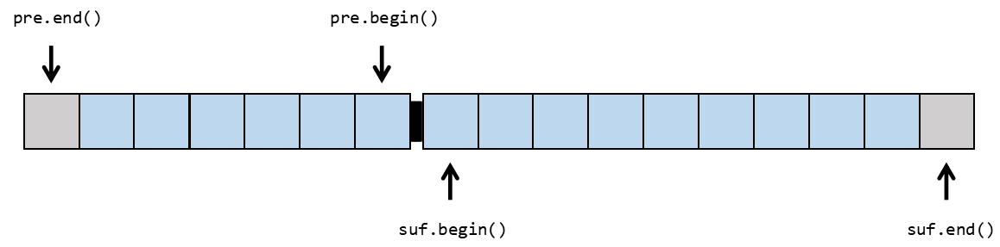

# AmortizedDeque

一个使用动态内存的 deque 实现。

## 什么是 deque

Deque 是 double-ended queue 的缩写，中文通常译作双向队列。
实际上，它的功能远比普通队列强大。

Deque 维护一个序列，主要支持在**首部或尾部快速添加一个元素，
首部尾部快速添加一个元素，以及对每个元素的随机访问**（可以简单理解为下标访问）。

在 C++ 标准库中，deque 的具体实现为在标头 `<deque>` 中定义的 `std::deque<T>`。
而 AmortizedDeque（均摊双向队列）是 deque 的另一个具体实现，
由于实现了 ISO C++14 指定的所有接口（以及一些 C++17 接口）
，可以作为 `std::deque<T>` 的替代品。

## 实现特点

### 优点

+ 拥有较小的初始空间（48 Bytes），
  而 libc++ 与 libstdc++ 的实现初始空间众所周知很大（可能是 512 Bytes）。
+ 只由两块内存块构成，内存访问更连续。

### 缺点

+ 复杂度为均摊常数。意思是，不保证每次添加元素和删除元素都是常数复杂度，但是
  若进行了 $n$ 次修改操作，那么复杂度是 $O(n)$ 的。
+ 由于只有两个内存块，若储存数据多（如 200 MB），对电脑内存要求较高。
+ 对引用的支持不很灵活。在 C++ 标准库中，要求在一些修改操作下，引用不失效。
  但是 AmortizedDeque 并没有完全做到这一点。

## 算法介绍

实现基于两个 STL 动态数组（`std::vector<T>`，以下称作 vector） $pre$ 和 $suf$。
关于 vector 的内容，
可以参考 [cppreference.com](https://zh.cppreference.com/w/cpp/container/vector)，
这里不再赘述。

将两个 vector 的首部相对摆放，看做一个序列使用。形象化地，$pre$ 的首部向后，
$suf$ 的首部向前：

随机访问元素，分类讨论下标在那个 vector 内即可。

若向序列头部加入元素，那么表现为在 $pre$ 尾部加入元素；  
若向序列尾部加入元素，那么表现为在 $suf$ 尾部加入元素。  
这些操作通过 vector 都很容易完成。

若删除头部的元素时，$pre$ 非空，那么可以直接 pop_back。删除尾部同理。  
若删除头部的元素时，$pre$ 为空，那么进行重构操作。删除尾部同理。

重构操作：暴力地将整个序列拆分成长度差不超过 $1$ 的两半，将其分别赋值给 
$pre$ 和 $suf$。整个过程是关于序列长度线性的。

可以证明，若 deque 内最多存在 $n$ 个元素，那么总复杂度 $O(n)$。均摊下来，每次
操作都是常数级别的。

<!--todo>
## 更多内容
</!-->